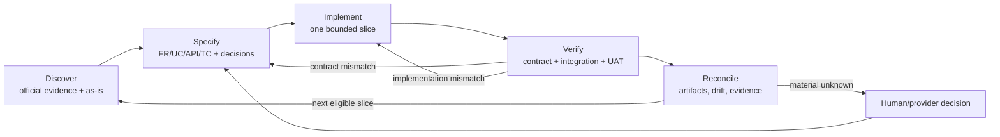

# Komerce/RajaOngkir Source of Truth dan Goal Loop

## Kendali dokumen

| Atribut | Nilai |
|---|---|
| Dokumen | Kontrak integrasi dan running plan Komerce/RajaOngkir untuk OceanMall |
| Versi | 0.1 |
| Status | **Reviewed** |
| Validasi manusia | **Belum Validated** |
| Tanggal tinjau bukti | 12 Agustus 2026, Asia/Jakarta |
| Rute Chain of Truth | Brownfield change + artifact-only |
| Cakupan | Shipping Cost, Shipping Delivery, Payment API, dan QRISLY |
| Perubahan aplikasi pada revisi ini | Ada; konfigurasi/client/alur berisiko rendah direkonsiliasi, sedangkan UAT tetap pending |

> `Reviewed` berarti bukti resmi dan kondisi codebase telah ditinjau secara teknis. Dokumen ini baru boleh diberi status `Validated` setelah pemilik produk/teknis menyetujui keputusan material dan UAT yang ditandai dalam register konflik selesai. Keberhasilan review AI atau test lokal tidak menggantikan persetujuan tersebut.

## Metode dan kredit

Dokumen ini mengikuti **Chain of Truth**, sebuah pendekatan source-of-truth-driven dari Farid Suryanto dan Muhammad Ibnu Athoillah. Metode ini menempatkan artefak yang dapat ditinjau sebagai penghubung antara requirement, user flow, kontrak integrasi, implementasi, dan bukti uji. Chain of Truth adalah kerangka kerja konseptual dan tidak menggantikan engineering judgment atau validasi stakeholder.

Referensi metode:

- [Dokumentasi Vibe Coding Research](https://faridsurya-dev.github.io/Vibe-Coding-Research/welcome)
- [Chain of Truth concept index](https://faridsurya-dev.github.io/Vibe-Coding-Research/en/1-concept/what-is-chain-of-truth)
- [Practice repository](https://github.com/faridsurya-dev/vibe_coding_simple_case)
- [Paper DOI](https://doi.org/10.5281/zenodo.20767965)

Alur dependensi yang dipakai untuk slice integrasi ini:

```text
Kebutuhan -> Use Case/User Flow -> Kontrak API/UCIC -> Implementasi -> Test -> Bukti UAT
```

Jika ditemukan cacat, perbaiki artefak paling awal yang keliru lalu propagasikan perubahan ke hilir. Jangan memperbaiki kode agar cocok dengan asumsi yang belum memiliki bukti.

## Tujuan, batas, dan definisi kebenaran

### Goal

Menyelaraskan integrasi OceanMall dengan kontrak resmi Komerce/RajaOngkir tanpa mengarang endpoint, header, unit, payload, status, rate limit, signature, atau perilaku fallback.

### Hasil yang diinginkan

1. Empat layanan mempunyai boundary konfigurasi, kredensial, base URL, kontrak request/response, dan test fixture yang terpisah.
2. Setiap perilaku aplikasi dapat ditelusuri dari requirement ke use case, API ID, implementasi, test case, dan bukti eksekusi.
3. Konflik dokumentasi tidak dipilih secara diam-diam; keputusan diberi bukti dan, bila material, dibuktikan melalui UAT.
4. Tidak ada klaim `Validated`, "sesuai resmi", atau "lulus" tanpa persetujuan atau bukti eksekusi yang sesuai.

### Di luar cakupan revisi ini

- Mengubah database atau secret.
- Mengirim request ke sandbox/production menggunakan kredensial nyata.
- Menentukan kontrak penuh Store Order, Pickup, dan Print Label yang belum dibaselining dari halaman endpoint rinci.
- Menjamin daftar courier, quota, harga, SLA, atau availability yang dapat berubah setelah tanggal tinjau bukti.

### Label bukti

| Label | Arti |
|---|---|
| `Observed` | Didukung langsung oleh dokumentasi resmi, koleksi Postman resmi, codebase, test, atau runtime evidence. |
| `Inferred` | Interpretasi beralasan dari bukti yang disebutkan, tetapi belum dikonfirmasi sebagai business intent. |
| `Conflict` | Sumber resmi atau sumber resmi dan implementasi saling tidak konsisten. |
| `Unknown` | Informasi material tidak tersedia pada bukti yang diperiksa. |

## Register sumber resmi

Semua sumber Komerce/RajaOngkir berikut diakses dan ditinjau pada 12 Agustus 2026. Salinan kontrak resmi terstruktur yang diambil langsung dari portal dokumentasi Komerce/RajaOngkir telah disimpan secara lokal di folder [docs/official-contracts/](file:///Users/apriansyahrs/Documents/Code/oceanmall/docs/official-contracts/README.md):

- [Shipping Cost API V2 Contract](file:///Users/apriansyahrs/Documents/Code/oceanmall/docs/official-contracts/shipping-cost-v2.md)
- [Shipping Delivery API V1 Contract](file:///Users/apriansyahrs/Documents/Code/oceanmall/docs/official-contracts/shipping-delivery-v1.md)
- [Payment API V1 Contract](file:///Users/apriansyahrs/Documents/Code/oceanmall/docs/official-contracts/payment-api-v1.md)
- [QRISLY API V1 Contract](file:///Users/apriansyahrs/Documents/Code/oceanmall/docs/official-contracts/qrisly-v1.md)

Sumber komunitas dan dokumentasi legacy `api.rajaongkir.com` tidak dipakai sebagai authority.

### Shipping Cost

| Source ID | Sumber resmi | Cakupan |
|---|---|---|
| SRC-SC-001 | [Endpoint overview](https://www.rajaongkir.com/docs/shipping-cost/getting_started/endpoint) | Base URL dan daftar endpoint |
| SRC-SC-002 | [API key](https://www.rajaongkir.com/docs/shipping-cost/getting_started/apikey) | Header `key`, pemisahan key, 401 |
| SRC-SC-003 | [Search domestic destination](https://www.rajaongkir.com/docs/shipping-cost/endpoint-rajaongkir-for-search-base/search-destination-rajaongkir) | Query dan response destinasi |
| SRC-SC-004 | [Calculate domestic cost](https://www.rajaongkir.com/docs/shipping-cost/endpoint-rajaongkir-for-search-base/calculate-domestic-cost) | Form request, response tarif, error |
| SRC-SC-005 | [Track waybill](https://www.rajaongkir.com/docs/shipping-cost/tracking) | Tracking AWB, response, error |
| SRC-SC-006 | [Courier availability](https://www.rajaongkir.com/docs/shipping-cost/getting_started/courier_availability) | Matriks fitur courier |
| SRC-SC-007 | [Halaman Postman collection](https://www.rajaongkir.com/docs/shipping-cost/getting_started/postman_collection) | Artefak request resmi |
| SRC-SC-008 | [Unduhan collection yang ditautkan resmi](https://drive.google.com/uc?export=download&id=1m8slSvl8YL8wc4zjVqRCvzRvBhjtBv_Y) | Method, header, encoding, contoh parameter |
| SRC-SC-009 | [Pricing](https://rajaongkir.com/pricing) | Quota harian per paket; bersifat volatile |
| SRC-SC-010 | [Documentation root](https://rajaongkir.com/docs) | Shipping Cost tetap live dan tidak mengikuti toggle sandbox dashboard |

### Shipping Delivery

| Source ID | Sumber resmi | Cakupan |
|---|---|---|
| SRC-SD-001 | [Base URL](https://rajaongkir.com/docs/delivery-order-api/getting_started/base-url) | Production/sandbox dan isolasi environment |
| SRC-SD-002 | [API key](https://www.rajaongkir.com/docs/delivery-order-api/getting_started/api-key) | Header `x-api-key`, key Shipping Delivery |
| SRC-SD-003 | [Search destination](https://www.rajaongkir.com/docs/delivery-order-api/search-destination) | Endpoint rinci dan response destinasi |
| SRC-SD-004 | [Calculate](https://www.rajaongkir.com/docs/delivery-order-api/calculate) | Query kalkulasi, kategori hasil, error |
| SRC-SD-005 | [History airway bill](https://www.rajaongkir.com/docs/delivery-order-api/history_awb) | Tracking Delivery |
| SRC-SD-006 | [Webhook](https://www.rajaongkir.com/docs/delivery-order-api/webhook) | Payload status dan acknowledgement |
| SRC-SD-007 | [3PL availability](https://www.rajaongkir.com/docs/delivery-order-api/getting_started/3pl) | Matriks courier Delivery |

### Payment API

| Source ID | Sumber resmi | Cakupan |
|---|---|---|
| SRC-PY-001 | [Available endpoints](https://rajaongkir.com/docs/payment-api/getting-started/available-endpoints) | Base URL, methods, create/status/cancel, response time guidance |
| SRC-PY-002 | [Authentication](https://rajaongkir.com/docs/payment-api/getting-started/authentication) | `x-api-key` dan JSON |
| SRC-PY-003 | [Callback handling](https://www.rajaongkir.com/docs/payment-api/getting-started/callback-handling) | HMAC-SHA256 raw body dan header callback |
| SRC-PY-004 | [Getting started](https://rajaongkir.com/docs/payment-api/getting-started/getting-started) | Base URL dan contoh auth yang berkonflik |

### QRISLY

| Source ID | Sumber resmi | Cakupan |
|---|---|---|
| SRC-QR-001 | [Available endpoints](https://www.rajaongkir.com/docs/qrisly/getting-started/available-endpoints) | Upload, generate, status, schema, nominal, expiry |
| SRC-QR-002 | [Webhook](https://www.rajaongkir.com/docs/qrisly/getting-started/webhook) | Event, payload, acknowledgement, retry |
| SRC-QR-003 | [Getting started](https://rajaongkir.com/docs/qrisly/getting-started/getting-started) | Produk dan pernyataan availability/rate control tanpa angka limit |

### Bukti codebase saat ini

| Evidence ID | Lokasi | Fakta as-is, bukan business intent |
|---|---|---|
| CODE-001 | `app/Services/Komerce/Concerns/UsesKomerceHttp.php` | Empat HTTP builder dan generic API-key fallback |
| CODE-002 | `app/Services/Komerce/ShippingCostClient.php` | Search dan calculate Shipping Cost |
| CODE-003 | `app/Services/Komerce/ShippingDeliveryClient.php` | Store, pickup, label, dan tracking Delivery |
| CODE-004 | `app/Services/Komerce/PaymentClient.php` | Create, status, dan cancel Payment |
| CODE-005 | `app/Services/Komerce/QrislyClient.php` | Generate dan status QRISLY |
| CODE-006 | `app/Http/Controllers/Concerns/VerifiesKomerceWebhookSecret.php` | HMAC yang digunakan oleh tiga webhook |
| CODE-007 | `app/Support/KomerceCallbackSignature.php` | Implementasi HMAC Payment |
| CODE-008 | `app/Domain/Shipping/Adapters/RajaOngkirShippingAdapter.php` | Mapping tarif dan adapter lama |
| CODE-009 | `app/Domain/Payment/Adapters/KomercePaymentAdapter.php` | Mapping Payment dan adapter lama |
| CODE-010 | `config/komerce.php` | Default base URL, key, feature switch, timeout |
| CODE-011 | `README.md` dan `.env.example` | Instruksi konfigurasi saat ini |
| TEST-001 | `tests/Unit/Services/Komerce/*Test.php` | Contract tests parsial untuk outbound client |
| TEST-002 | `tests/Feature/Komerce/*Test.php` | Journey parsial payment, delivery, label, dan webhook |

### Urutan authority

1. Halaman endpoint rinci dan curl resmi serta Postman collection resmi.
2. Halaman authentication/base URL resmi.
3. Endpoint overview, tips, pricing, dan availability.
4. Codebase dan test sebagai bukti **as-is**, bukan bukti bahwa kontrak provider benar.

Jika sumber dalam level yang sama berkonflik, jangan menggabungkan keduanya menjadi kontrak baru. Catat pada register konflik dan lakukan UAT atau minta konfirmasi provider.

## Boundary empat layanan

| Service ID | Produk | Base URL production | Sandbox | Auth outbound | Encoding utama | Aturan boundary |
|---|---|---|---|---|---|---|
| SVC-SC | Shipping Cost API V2 | `https://rajaongkir.komerce.id/api/v1/` | Tidak tersedia; selalu live | `key: <SHIPPING_COST_KEY>` | Search query; calculate form URL-encoded | Tidak boleh memakai key Delivery/Payment |
| SVC-SD | Shipping Delivery | `https://api.collaborator.komerce.id/` | `https://api-sandbox.collaborator.komerce.id/` | `x-api-key: <SHIPPING_DELIVERY_KEY>` | Query atau JSON sesuai endpoint | Key dan data sandbox/production terpisah |
| SVC-PY | Payment API | `https://api.collaborator.komerce.id/user` | `https://api-sandbox.collaborator.komerce.id/user` | `x-api-key: <PAYMENT_KEY>` | JSON | Callback HMAC hanya terbukti untuk layanan ini |
| SVC-QR | QRISLY | `https://api.collaborator.komerce.id/user` | `https://api-sandbox.collaborator.komerce.id/user` | `x-api-key: <QRISLY_KEY>` | JSON; upload multipart | Produk terpisah dari QRIS pada Payment API |

Ketentuan boundary:

- Setiap service memiliki config key eksplisit. Tidak ada fallback diam-diam dari key khusus ke generic key atau key service lain.
- Kesamaan host Payment dan QRISLY tidak berarti kedua produk berbagi contract, credentials, status enum, callback, atau expiry.
- Shipping Cost dan Shipping Delivery mempunyai daftar courier serta tracking endpoint berbeda.
- Base URL disimpan tanpa duplikasi path. Contract test harus menguji URL final, bukan hanya konstanta endpoint.
- Secret tidak boleh dikirim ke browser, dicetak ke log, dimasukkan ke fixture, atau ditulis ke dokumen ini.

## Requirements

### Functional requirements

| ID | Requirement atomik | Evidence | Status |
|---|---|---|---|
| FR-001 | Sistem harus mengisolasi base URL, API key, header, dan feature switch untuk SVC-SC, SVC-SD, SVC-PY, dan SVC-QR. | SRC-SC-002, SRC-SD-002, SRC-PY-002, SRC-QR-001 | Reviewed |
| FR-002 | Sistem harus mencari destinasi domestik Shipping Cost dengan `GET`, query `search`, `limit`, `offset`, dan mengembalikan ID serta label lokasi yang dapat dipakai pada kalkulasi. | SRC-SC-003, SRC-SC-008 | Reviewed |
| FR-003 | Sistem harus menghitung Shipping Cost domestik dengan form URL-encoded berisi `origin`, `destination`, berat gram, dan courier yang dapat dipisah `:`. | SRC-SC-004, SRC-SC-008 | Reviewed |
| FR-004 | Bila Shipping Cost tracking dipakai, sistem harus mengirim AWB dan courier ke API-SC-003 serta menoleransi kebutuhan conditional `last_phone_number`. | SRC-SC-005, SRC-SC-008 | Reviewed; UAT conditional |
| FR-005 | Bila Shipping Delivery rate dipakai, sistem harus mencari destination ID lalu memanggil kalkulasi dengan field dan kategori respons resmi SVC-SD. | SRC-SD-003, SRC-SD-004 | Reviewed; unit berat UAT |
| FR-006 | Proses fulfillment harus membuat order Delivery, meminta pickup, dan mencetak label hanya berdasarkan kontrak endpoint rinci yang telah dibaselining dan dengan idempotency per order. | CODE-003 | Unknown contract; blocked |
| FR-007 | Sistem harus melacak Shipping Delivery dengan `shipping` dan `airway_bill`, serta memproses update Delivery tanpa menganggapnya realtime. | SRC-SD-005, SRC-SD-006 | Reviewed; webhook auth Unknown |
| FR-008 | Sistem harus membuat Payment VA atau QRIS Payment API menggunakan JSON dan field resmi, serta menyimpan payment ID dan instruksi yang dikembalikan provider. | SRC-PY-001, SRC-PY-002 | Reviewed |
| FR-009 | Sistem harus membaca status Payment dan hanya membatalkan Payment berstatus pending, dengan normalisasi status resmi. | SRC-PY-001 | Reviewed |
| FR-010 | Sistem harus memverifikasi Payment callback dengan HMAC-SHA256 atas raw request body menggunakan `callback_API_KEY`, lalu merekonsiliasi status/amount secara idempotent. | SRC-PY-003 | Reviewed |
| FR-011 | Sistem harus membuat QRISLY dari `qris_id`, amount, output type, dan opsi unique amount, lalu menyimpan `history_id`, nilai final, payload QR, status, dan expiry. | SRC-QR-001 | Reviewed |
| FR-012 | Sistem harus membaca status QRISLY dan menerima event `payment.success` atau `payment.expired` menggunakan schema resmi; autentikasi inbound tidak boleh diasumsikan tanpa bukti. | SRC-QR-001, SRC-QR-002 | Reviewed; webhook auth Unknown |
| FR-013 | Semua client harus mempertahankan HTTP status dan meta/error provider yang relevan agar UI, retry policy, log, dan test dapat membedakan validation, auth, not-found, no-rate, dan server failure. | Semua halaman endpoint | Reviewed |

### Non-functional requirements

| ID | Requirement terukur | Verifikasi |
|---|---|---|
| NFR-001 | Tidak ada secret/API key/signature/PII sensitif yang tampil di browser, log, exception message, fixture committed, atau telemetry. | Static scan + log assertion |
| NFR-002 | Polling Payment status untuk payment ID yang sama tidak boleh lebih sering dari satu kali per 3 detik; retry memakai backoff dan tidak mengulang create/cancel secara buta. | Fake clock + request-count test |
| NFR-003 | Callback dan job retry harus idempotent: payload/event identik tidak boleh menggandakan payment capture, stock transition, Delivery order, pickup, atau shipment state. | Repeated-event tests |
| NFR-004 | Timeout HTTP merupakan kebijakan aplikasi yang configurable dan tidak boleh diklaim sebagai angka resmi provider. | Config test + documentation review |
| NFR-005 | Setiap service menghasilkan telemetry terpisah: service ID, API ID, outcome class, latency, provider request/reference ID bila ada; tanpa secret/body sensitif. | Structured-log test/review |
| NFR-006 | Setiap API ID yang diimplementasikan mempunyai contract test untuk method, URL, header, encoding, request fields, success mapping, dan error mapping. | Trace matrix tidak memiliki API implemented tanpa TC |
| NFR-007 | Perubahan dapat dinonaktifkan per service dan di-rollback tanpa migrasi destruktif atau kehilangan referensi transaksi/shipment provider. | Rollback rehearsal |
| NFR-008 | Quota/rate limit yang tidak didokumentasikan tidak boleh diberi angka rekaan; quota Shipping Cost dibaca sebagai plan-dependent dan volatile. | Docs review |

## Use case dan user flow ringkas

| ID | Aktor/pemicu | Main flow | Postcondition | Requirement/API |
|---|---|---|---|---|
| UC-001 | Customer mengisi alamat checkout | Debounce pencarian -> API-SC-001 -> pilih ID -> hitung paket/gram -> API-SC-002 -> tampilkan layanan tersedia | Pilihan courier/service/cost mengacu response provider | FR-001, FR-002, FR-003; API-SC-001/002 |
| UC-002 | Customer/admin meminta tracking via Shipping Cost | Validasi AWB+courier -> API-SC-003 -> map summary/status/manifest -> tampilkan atau retry berjarak | Riwayat tersimpan/ditampilkan tanpa menganggap realtime | FR-004, FR-013; API-SC-003 |
| UC-101 | Sistem/admin membutuhkan quote Delivery | Cari destination -> sediakan pinpoint bila ada -> kalkulasi -> kelompokkan regular/cargo/instant | Tarif Delivery tidak bercampur dengan Shipping Cost | FR-001, FR-005; API-SD-001/002 |
| UC-102 | Order siap dipenuhi | Buat Delivery order sekali -> simpan order number -> request pickup sekali -> print label setelah eligible | Provider reference tersimpan sebelum retry | FR-006, NFR-003; API-SD-003A/B/C |
| UC-103 | Scheduler/admin/webhook memperbarui shipment | Poll API-SD-004 atau terima API-SD-005 -> normalisasi status -> update idempotent | Shipment dan order konsisten | FR-007, FR-013; API-SD-004/005 |
| UC-201 | Customer memilih VA/QRIS Payment API | Bangun customer/items/amount/callback -> API-PY-002 -> validasi response -> simpan payment ID dan instruksi | Pending transaction dapat dilanjutkan | FR-008; API-PY-001/002 |
| UC-202 | Customer/scheduler menyinkronkan atau membatalkan Payment | Throttle -> API-PY-003 -> map status; bila expired/pending dan authorized -> API-PY-004 | Status lokal direkonsiliasi tanpa duplicate side effect | FR-009, NFR-002/003; API-PY-003/004 |
| UC-203 | Provider mengirim Payment callback | Ambil raw body -> verifikasi API-PY-005 -> validasi payload -> fetch status bila perlu -> cek amount -> idempotent transition -> 2xx | Hanya callback sah yang mengubah payment/order | FR-010, NFR-001/003; API-PY-005 |
| UC-301 | Customer memilih QRISLY | Pastikan produk enabled -> API-QR-002 -> validasi history/amount/QR/expiry -> simpan | Pending QRISLY transaction tercatat | FR-011; API-QR-002 |
| UC-302 | Customer/scheduler/webhook menyinkronkan QRISLY | API-QR-003 atau API-QR-004 -> map lowercase status/event -> cek amount -> idempotent transition | Payment lokal konsisten dengan QRISLY | FR-012, NFR-003; API-QR-003/004 |

### UCIC coverage

Setiap use case yang diimplementasikan mempunyai satu kontrak integrasi ringkas. Schema detail tetap berada pada API ID terkait agar satu endpoint tidak didefinisikan berbeda di beberapa tempat.

| UCIC ID | Use case | Interface dan auth | Mapping/side effect | Idempotency dan failure rule |
|---|---|---|---|---|
| UCIC-001 | UC-001 | API-SC-001/002; header `key` | Destination `id` -> origin/destination; berat paket -> gram; provider row -> pilihan rate | Read-only; debounce/cache; no-rate bukan fake rate |
| UCIC-002 | UC-002 | API-SC-003; header `key` | AWB/courier -> summary/status/manifest | Read-only; retry berjarak; 404 tidak mengubah shipment menjadi delivered |
| UCIC-101 | UC-101 | API-SD-001/002; `x-api-key` Delivery | Destination/pinpoint/weight/value -> regular/cargo/instant quote | Read-only; kategori kosong dipertahankan; unit menunggu UAT-U02 |
| UCIC-102 | UC-102 | API-SD-003A/B/C; `x-api-key` Delivery | Order -> provider order no -> pickup -> label; references disimpan | Create/pickup tidak diulang bila reference/ack sudah ada; blocked sampai schema resmi lengkap |
| UCIC-103 | UC-103 | API-SD-004 dan API-SD-005 | Provider `last_status`/webhook status -> canonical shipment state | Event/poll replay tidak menggandakan transition; auth inbound menunggu UAT-U03 |
| UCIC-201 | UC-201 | API-PY-001/002; `x-api-key` Payment | Order/customer/items -> payment ID + VA/QR/URL/expiry | Satu active provider payment per attempt; timeout direkonsiliasi sebelum create ulang |
| UCIC-202 | UC-202 | API-PY-003/004; `x-api-key` Payment | Provider enum -> canonical payment/order state | Throttle 3 detik per ID; cancel hanya pending; repeated sync side-effect free |
| UCIC-203 | UC-203 | API-PY-005; verified HMAC raw body | Valid callback -> remote status/amount reconciliation -> paid transition | Signature first, amount check, repeated callback menghasilkan state sama |
| UCIC-301 | UC-301 | API-QR-002; `x-api-key` QRISLY | Order amount/template -> history ID + QR + final amount + expiry | Satu active QRISLY history per attempt; response invariant wajib dicek |
| UCIC-302 | UC-302 | API-QR-003/004 | Lowercase status/event -> canonical payment/order state | Repeated poll/event safe; inbound auth menunggu UAT-U06 |

Exception flow umum:

- `401`: hentikan retry otomatis, klasifikasikan configuration/auth failure, jangan bocorkan key.
- `404`: bedakan destination/no-AWB/history-not-found dari route yang salah; jangan mengubahnya menjadi array kosong tanpa telemetry.
- `400/422`: pertahankan field/message provider yang aman untuk diagnosis; jangan retry tanpa memperbaiki request.
- `429` bila muncul: hormati `Retry-After` bila tersedia; karena angka umum tidak terdokumentasi, gunakan bounded exponential backoff.
- `5xx`/network timeout: retry hanya operasi read atau operasi write yang mempunyai idempotency/reconciliation evidence. Jangan membuat ulang payment/Delivery order secara buta.

## Kontrak API/UCIC

### SVC-SC — Shipping Cost API V2

Common contract:

- Base: `https://rajaongkir.komerce.id/api/v1/`.
- Auth: header `key` khusus Shipping Cost.
- Tidak ada sandbox resmi; jangan melakukan UAT write/poll berlebihan ke production.
- Envelope contoh: `meta.message`, `meta.code`, `meta.status`, lalu `data`.
- Snapshot pricing 12 Agustus 2026: Starter 100 hit/hari, Pro 25.000 hit/hari, Enterprise 50.000 hit/hari. Angka ini plan-dependent dan wajib dibuka ulang sebelum release.

| API ID | Method dan path | Request | Success contract | Error/status |
|---|---|---|---|---|
| API-SC-001 | `GET destination/domestic-destination` | Query: `search` required; `limit`, `offset` optional | `data[]`: `id`, `label`, `province_name`, `city_name`, `district_name`, `subdistrict_name`, `zip_code` | 404 no result, 422 missing param, 500 |
| API-SC-002 | `POST calculate/domestic-cost` | Form URL-encoded: `origin`, `destination`, `weight` integer gram, `courier` colon-separated; `price=lowest|highest` optional/uncertain | `data[]`: `name`, `code`, `service`, `description`, `cost`, `etd` | 400 missing/no rate, 422 invalid courier; client juga toleran pada empty data |
| API-SC-003 | `POST track/waybill` | Official curl/Postman: query `awb`, `courier`; `last_phone_number` conditional/uncertain | `data.delivered`, `summary`, `details`, `delivery_status`, `manifest[]` | 400 missing, 401 auth, 404 AWB not found |

Mapping rule API-SC-002: normalizer primer harus menerima flat service rows resmi. Dukungan format legacy nested `costs` hanya boleh dipertahankan sebagai compatibility adapter yang diuji dan diberi label, bukan dianggap sebagai kontrak V2.

### SVC-SD — Shipping Delivery

Common contract:

- Production base: `https://api.collaborator.komerce.id/`.
- Sandbox base: `https://api-sandbox.collaborator.komerce.id/`.
- Auth: `x-api-key` khusus Shipping Delivery.
- Courier matrix SVC-SD berdiri sendiri dan tidak boleh diturunkan dari SVC-SC.

| API ID | Method dan path | Request | Success contract | Error/status |
|---|---|---|---|---|
| API-SD-001 | `GET /tariff/api/v1/destination/search` | Query `keyword` menurut endpoint rinci | `meta` + `data[]`: `id`, `label`, `subdistrict_name`, `district_name`, `city_name`, `zip_code` | Detail error belum lengkap pada halaman yang ditinjau |
| API-SD-002 | `GET /tariff/api/v1/calculate` | Query: `shipper_destination_id`, `receiver_destination_id`, `origin_pin_point`, `destination_pin_point`, `weight`, `item_value`; `cod=yes|no` optional | Object dengan `calculate_reguler`, `calculate_cargo`, `calculate_instant`; row: `shipping_name`, `service_name`, `weight`, `is_cod`, biaya/cashback/net/grandtotal/fee/income, `etd` | 400 param, 401 auth, 422 missing, 500; array kategori dapat kosong |
| API-SD-003A | `POST /order/api/v1/orders/store` | **Unknown** sampai halaman schema rinci dibaselining | Existing code mengharapkan provider order reference | Blocked untuk perubahan contract |
| API-SD-003B | `POST /order/api/v1/pickup/request` | **Unknown** sampai halaman schema rinci dibaselining | Existing code mengharapkan pickup accepted | Blocked untuk perubahan contract |
| API-SD-003C | `POST /order/api/v1/orders/print-label` | **Unknown** sampai halaman schema rinci dibaselining | Existing code mengharapkan label path/base64 | Blocked untuk perubahan contract |
| API-SD-004 | `GET /order/api/v1/orders/history-airway-bill` | Query `shipping`, `airway_bill` | `data`: `airway_bill`, `last_status`, `history[] {desc,date,code,status}` | 400 AWB not found, 422 retrieval/param, 500 |
| API-SD-005 | Inbound webhook ke URL merchant | Docs menyatakan incoming POST dengan `{order_no, cnote, status}` | Receiver mengembalikan HTTP 200 setelah proses/acknowledgement aman | Signature/header auth **tidak didokumentasikan** |

Unit API-SD-002 masih `Conflict`: schema, curl, dan contoh response mendukung float kilogram, sementara satu tips mengatakan gram. Kandidat kontrak adalah kilogram, tetapi perubahan konversi harus menunggu UAT-U02.

### SVC-PY — Payment API

Common contract:

- Production base: `https://api.collaborator.komerce.id/user`.
- Sandbox base: `https://api-sandbox.collaborator.komerce.id/user`.
- Auth: `x-api-key` khusus Payment; request JSON.
- Halaman pembayaran customer: production `https://pay.komerce.id/{token}`, sandbox `https://pay-sandbox.komerce.id/{token}` bila response mengembalikan token/URL terkait.

| API ID | Method dan path | Request | Success contract | Error/status |
|---|---|---|---|---|
| API-PY-001 | `GET /api/v1/user/methods` | Tidak ada body | Metode dengan `payment_type`, display/bank/logo, min/max, currency; cache guidance 1 jam | Auth/server errors |
| API-PY-002 | `POST /api/v1/user/payment/create` | VA: `order_id`, `payment_type=bank_transfer`, `channel_code`, `amount`, `customer`, `items`, `expiry_duration`, callback fields. QRIS Payment: `payment_type=qris`, tanpa channel | `payment_id`, `payment_url`, VA/bank atau `qr_string`, amount, `status=PENDING`, expiry/timestamps | 400, 401, 404, 500; VA/QRIS min Rp10.000; VA expiry min 3600 detik; QRIS expiry fixed 5 menit |
| API-PY-003 | `GET /api/v1/user/payment/status/{payment_id}` | Path payment ID | Status `PENDING`, `PAID`, `EXPIRED`, `CANCELED` | Maksimum satu request per 3 detik per payment ID |
| API-PY-004 | `POST /api/v1/user/payment/cancel` | JSON `payment_id`, `reason` | Cancel hanya untuk pending; VA dinonaktifkan, QRIS akan expire | 400, 401, 404, 500 |
| API-PY-005 | Inbound Payment callback | Header `X-Callback-Api-Key` = hex HMAC-SHA256(raw body, `callback_API_KEY`) | Constant-time verify, proses idempotent, balas 200 | Invalid signature 401/403 |

`callback_API_KEY` adalah casing pada halaman endpoint rinci dan codebase; overview juga menampilkan `callback_api_key`. UAT-U04 harus memastikan casing yang diterima sebelum kontrak diberi status Validated.

### SVC-QR — QRISLY

Common contract:

- Production base: `https://api.collaborator.komerce.id/user`.
- Sandbox base: `https://api-sandbox.collaborator.komerce.id/user`.
- Auth: `X-API-Key`; casing header secara HTTP tidak signifikan, tetapi test menggunakan nama canonical `x-api-key`.

| API ID | Method dan path | Request | Success contract | Error/status |
|---|---|---|---|---|
| API-QR-001 | `POST /api/v1/qrisly/upload-qris` | Multipart: `name` <=100, `qris_image` PNG/JPG <=5 MB | `qris_id` | Validation/auth/server errors |
| API-QR-002 | `POST /api/v1/qrisly/generate-qris` | JSON: `qris_id`, `amount` >=1000, `output_type=string|image`, `unique_amount` bool default true | `success`, `message`, `data {history_id,qris_string,original_amount,final_amount,payment_status,expiry_time}`; default expiry 15 menit | Validation examples menyebut max 100.000.000; angka perlu dites di sandbox bila relevant |
| API-QR-003 | `GET /api/v1/qrisly/payment-status/{history_id}` | Path history ID | `meta` + data; status lowercase `unpaid`, `paid`, `expired`, `cancelled` | 404 history not found; repeated checks disebut tidak berbiaya, tetapi rate numerik Unknown |
| API-QR-004 | Inbound QRISLY webhook | POST event `payment.success`/`payment.expired`; data berisi history/qris ID, amount, original amount, status, timestamp terkait | Balas HTTP 200 JSON `success` dan `message`; retry 1, 5, 15 menit, total 3 | Signature/header auth **tidak didokumentasikan** |

QRIS pada SVC-PY dan SVC-QR adalah alternatif provider path. Fallback dari QRISLY ke Payment API hanya boleh terjadi sebagai pilihan produk yang eksplisit dan teruji, bukan karena memakai key service lain secara diam-diam.

## Register konflik, unknown, dan UAT

| ID | Label | Temuan | Keputusan sementara | Gate penyelesaian |
|---|---|---|---|---|
| CON-001 | Conflict | Search Shipping Cost prose berkata POST, tetapi table/curl/overview/Postman berkata GET. | Gunakan GET. | Contract test; optional smoke request aman |
| CON-002 | Conflict | Tips calculate Shipping Cost menyebut Bearer, auth/curl/Postman menyebut header `key`. | Gunakan `key`; jangan Bearer. | Contract test |
| CON-003 | Conflict | `price` ditulis boolean tetapi nilai `lowest|highest`. | Jangan kirim kecuali dibutuhkan; bila dipakai kirim string. | UAT-U01 |
| CON-004 | Conflict | Tracking Shipping Cost dilabel form body, curl/Postman memakai query. | Gunakan query. | UAT-U01 |
| CON-005 | Conflict | `last_phone_number` disebut required, tetapi curl/Postman menghilangkannya. | Modelkan optional/conditional per courier. | UAT-U01 dengan courier yang mensyaratkan |
| CON-006 | Conflict | Daftar courier halaman availability lebih pendek dari homepage/Postman resmi. | Jangan hardcode sebagai authority final; konfigurasi/runtime discovery. | UAT-U01 dan dashboard plan aktif |
| CON-007 | Conflict | Overview Delivery menunjukkan `/destination/`, halaman rinci menunjukkan `/destination/search`. | Gunakan endpoint rinci `/search`. | UAT-U02 |
| CON-008 | Conflict | Delivery calculate: schema/curl/response menunjukkan kg, satu tips mengatakan gram. | Kandidat kilogram; jangan ubah conversion sebelum UAT. | **UAT-U02 blocker** |
| CON-009 | Conflict | Pinpoint ditandai required, prose menyatakan dibutuhkan untuk instant. | Kirim bila tersedia; uji regular/cargo tanpa pinpoint. | UAT-U02 |
| CON-010 | Conflict | Delivery webhook dijelaskan sebagai incoming POST, contoh handler memakai PUT. | Route merchant menerima POST. | UAT-U03/provider confirmation |
| CON-011 | Unknown | Tidak ada signature/header auth Delivery webhook pada docs. | Jangan menyatakan Payment HMAC berlaku. Pilih kontrol hanya setelah bukti. | **UAT-U03 blocker** |
| CON-012 | Conflict | Payment getting-started menyebut Bearer/`key`, auth dan endpoint rinci memakai `x-api-key`. | Gunakan `x-api-key`. | Contract test + sandbox |
| CON-013 | Conflict | Payment callback field memakai `callback_API_KEY` vs `callback_api_key`. | Pertahankan uppercase sampai UAT. | UAT-U04 |
| CON-014 | Conflict | Payment official status `CANCELED`; sebagian code/test memakai `CANCELLED`. | Normalizer boundary menerima provider `CANCELED` dan canonical internal `cancelled`; compatibility variant diuji terpisah. | TC-204 |
| CON-015 | Conflict | QRISLY example request amount 100.000 tetapi response example original amount 1.000. | Perlakukan sebagai contoh docs yang tidak konsisten; validasi invariant terhadap request/response nyata. | UAT-U05 |
| CON-016 | Unknown | Tidak ada signature/header auth QRISLY webhook pada docs. | Jangan menyatakan Payment HMAC berlaku. | **UAT-U06 blocker** |
| CON-017 | Unknown | Timeout numerik provider tidak didokumentasikan. | `KOMERCE_TIMEOUT` adalah app policy, bukan provider contract. | Load/failure test internal |
| CON-018 | Unknown | Rate per detik umum tidak tersedia untuk Shipping Cost/Delivery/QRISLY. | Jangan mengarang; gunakan quota plan dan backoff defensif. | Monitor response headers/UAT |
| CON-019 | Unknown | Repo/SDK publik resmi API V2 tidak ditemukan. | Official docs + Postman menjadi authority; jangan ambil SDK komunitas. | Recheck bila provider memberi repo resmi |
| CON-020 | Unknown | Contract rinci Store Order, Pickup, dan Print Label belum ditinjau pada research slice ini. | Bekukan refactor payload terkait. | Discover halaman resmi sebelum RUN-04 |

### UAT matrix

| UAT ID | Environment | Skenario | Bukti yang wajib disimpan | Larangan |
|---|---|---|---|---|
| UAT-U01 | Shipping Cost live, request minimum | Search, calculate 1 courier, tracking test AWB aman; cek `price`, query, phone conditional | Sanitized request shape, HTTP/meta code, schema response, timestamp | Jangan simpan key/PII; hormati quota |
| UAT-U02 | Shipping Delivery sandbox | Search dan calculate regular/cargo/instant dengan berat pembanding dan pinpoint on/off | Input physical weight, query unit, returned weight/cost/category | Jangan memakai production key |
| UAT-U03 | Shipping Delivery sandbox/webhook setup | Capture header dan method webhook nyata, replay idempotent | Sanitized headers, raw schema hash, response/retry behavior | Jangan menonaktifkan auth tanpa compensating control |
| UAT-U04 | Payment sandbox | Create VA/QRIS, status interval, cancel, callback casing/signature | Sanitized request/response, raw-body signature result, timing | Jangan log callback secret atau account number utuh |
| UAT-U05 | QRISLY sandbox | Generate amount, unique amount, expiry, status transitions | Original/final amount invariant, history ID, status/expiry | Jangan reuse Payment key jika dashboard memberi key terpisah |
| UAT-U06 | QRISLY webhook setup | Capture actual auth headers dan retries | Sanitized headers, event schema, retry timestamps | Jangan memalsukan signature contract |

## Drift codebase yang harus direkonsiliasi

| Drift ID | Evidence | As-is | Risiko | Repair source pertama |
|---|---|---|---|---|
| DRIFT-001 | CODE-001, CODE-010 | Dedicated key dapat fallback ke `KOMERCE_API_KEY`. | Key service salah dapat terkirim ke host lain; auth failure atau boundary leak. | FR-001 + service config contract |
| DRIFT-002 | CODE-008, TEST-001 | Parser tarif primer mengharapkan courier dengan nested `costs`, sementara V2 resmi memberi flat row service. | Rate resmi dapat hilang/empty walau response sukses. | API-SC-002 mapping |
| DRIFT-003 | CODE-008 | Adapter lama memanggil `createPickupOrder`/`trackWaybill` yang tidak ada pada CODE-003. | Runtime failure bila binding tersebut aktif. | UC-102/103 dan API-SD contracts |
| DRIFT-004 | CODE-009 | Adapter lama memanggil method QRISLY yang tidak ada pada CODE-005 dan memetakan field legacy. | Runtime failure atau payment reference salah. | UC-301 dan API-QR-002 |
| DRIFT-005 | CODE-006, Delivery/Qrisly controllers | Payment HMAC diwajibkan juga untuk Delivery dan QRISLY. | Webhook resmi tanpa header tersebut dapat selalu 401 dan provider terus retry. | CON-011/016; jangan patch sebelum UAT auth |
| DRIFT-006 | CODE-009 | Normalizer Payment tidak mencakup official `CANCELED` single-L. | Canceled payment dapat diperlakukan pending. | API-PY-003 status mapping |
| DRIFT-007 | CODE-002 | Shipping Cost client belum menyediakan API-SC-003 tracking. | UC-002 tidak tersedia melalui client ini; tracking mungkin bercampur ke Delivery. | FR-004/API-SC-003 decision |
| DRIFT-008 | CODE-003 | Search dan calculate Delivery belum tersedia; Store/Pickup/Label schema belum ditrace penuh. | Contract coverage timpang dan unit berat belum terkontrol. | CON-020 lalu API-SD-001/002/003 |
| DRIFT-009 | TEST-001/002 | Sebagian fixture mengandung schema legacy atau membuktikan perilaku HMAC yang tidak didukung docs. | Test hijau dapat mengunci asumsi salah. | Re-derive fixtures dari API IDs |
| DRIFT-010 | CODE-011 | README menyatakan semua webhook memakai Payment HMAC. | Operator menganggap klaim tanpa bukti sebagai contract resmi. | CON-011/016 dan validation log |

Drift adalah temuan teknis, bukan izin untuk langsung mengubah semua file. Repair mengikuti running plan dan gate UAT.

## Test traceability

Status test pada tabel ini menunjukkan keberadaan/niat test, bukan hasil eksekusi. Tidak ada test aplikasi yang dijalankan dalam pembuatan revisi dokumen ini.

| TC ID | Trace | Skenario/verifikasi | Evidence test saat ini | Status |
|---|---|---|---|---|
| TC-001 | FR-002 -> UC-001 -> API-SC-001 | Exact GET, query, `key`, mapping lokasi, 404/422 | `ShippingCostClientTest::test_search_domestic_fetches_destination_results` | Existing partial |
| TC-002 | FR-003 -> UC-001 -> API-SC-002 | Exact form POST, gram, colon couriers, dedicated key | `ShippingCostClientTest::test_calculate_posts_form_payload_with_shipping_key_header` | Existing partial |
| TC-003 | FR-003/013 -> API-SC-002 | Flat V2 rows menjadi semua rate; legacy fixture isolated | Belum ada | Planned P0 |
| TC-004 | FR-004 -> UC-002 -> API-SC-003 | Query AWB/courier, phone conditional, summary/manifest, 400/404 | Belum ada | Planned |
| TC-101 | FR-005 -> UC-101 -> API-SD-001/002 | `/destination/search`, query kalkulasi, kategori termasuk `calculate_reguler`, empty arrays | Belum ada | Planned |
| TC-102 | FR-005 -> API-SD-002 | UAT weight kg vs gram dan pinpoint | Belum ada | Blocked UAT-U02 |
| TC-103 | FR-007 -> UC-103 -> API-SD-004 | `shipping` + `airway_bill`, `last_status`/history, errors | `ShippingDeliveryTest::test_delivery_client_tracks_with_shipping_and_airway_bill_query_params` | Verified |
| TC-104 | FR-006 -> UC-102 -> API-SD-003A/B/C | Exact official payloads, reference persisted before retry, duplicate job idempotent, label eligibility | `ShippingDeliveryTest`, `PrintLabelTest`, `WarehouseOpsE2ETest` | Verified |
| TC-105 | FR-007 -> UC-103 -> API-SD-005 | Official payload, method, idempotency, provider-verified auth, HTTP ack | `DeliveryWebhookTest` | Existing assumption blocked UAT-U03 |
| TC-201 | FR-008 -> UC-201 -> API-PY-001/002 | VA/QRIS JSON, dedicated key, min/expiry/callback fields, response mapping | `PaymentClientTest`, `KomerceCheckoutTest` | Existing partial |
| TC-202 | FR-009 -> UC-202 -> API-PY-003/004 | Status enum including `CANCELED`; pending-only cancel; 400/401/404/500 | `PaymentClientTest`, `ExpireUnpaidKomerceOrderTest` | Existing partial |
| TC-203 | NFR-002 -> UC-202 -> API-PY-003 | Maksimum 1 status request/3 detik/payment ID, backoff | Belum ada | Planned P0 |
| TC-204 | FR-010 -> UC-203 -> API-PY-005 | HMAC atas **raw** body, constant time, plain secret/invalid rejected | `PaymentWebhookTest` | Existing partial; retain |
| TC-205 | FR-010/NFR-003 -> UC-203 | Callback duplicate, remote status check, amount mismatch, no double stock/payment | `PaymentWebhookTest`, `KomerceCheckoutTest` | Existing partial |
| TC-301 | FR-011 -> UC-301 -> API-QR-002 | Generate JSON, dedicated key, history/QR/final amount/expiry | `QrislyClientTest`, `QrislyCheckoutTest` | Existing partial |
| TC-302 | FR-012 -> UC-302 -> API-QR-003 | Lowercase statuses, 404, repeat-safe polling | `QrislyClientTest::test_get_payment_status_hits_history_endpoint` | Existing partial |
| TC-303 | FR-012 -> UC-302 -> API-QR-004 | Event/payload resmi, status field, HTTP 200, retry-safe, provider-verified auth | `QrislyWebhookTest` | Existing assumption blocked UAT-U06 |
| TC-401 | FR-001/NFR-001 | Setiap client memakai hanya dedicated key; missing key fails closed; tidak ada generic fallback | Existing dedicated-key tests terbatas | Planned P0 |
| TC-402 | FR-001 | Feature switch per service mencegah outbound request tanpa config | `KomerceDisabledTest` | Existing partial |
| TC-403 | NFR-001/005 | Redaction secret/signature/PII dan structured telemetry | Belum ada | Planned |
| TC-404 | NFR-007 | Disable/re-enable service dan rollback tanpa kehilangan provider references | Belum ada | Planned release gate |

Minimum trace gate: sebuah API tidak boleh diberi status Implemented/Done jika tidak memiliki sekurangnya satu success contract test dan satu representative error/edge test yang menautkan API ID.

## Goal loop: Discover -> Specify -> Implement -> Verify -> Reconcile



### 1. Discover

- Pilih satu slice `RUN-*`, baca requirement/use case/API/test IDs terkait.
- Periksa git status dan perubahan pengguna; jangan menimpa perubahan di luar slice.
- Buka ulang halaman resmi terkait karena contract dapat berubah.
- Inventarisasi caller, config, DTO, mapper, routes, jobs, webhook, tests, dan operational docs.
- Tambahkan bukti sebagai `Observed`, `Inferred`, `Conflict`, atau `Unknown`.

**Exit:** semua boundary yang akan diubah mempunyai evidence ledger; tidak ada endpoint/field/status yang berasal dari ingatan atau sumber komunitas.

### 2. Specify

- Perbarui requirement, use case, API contract, error semantics, mapping, acceptance criteria, dan TC sebelum kode.
- Pecah decision material menjadi UAT/approval yang eksplisit.
- Tentukan compatibility behavior; jangan mencampur schema legacy dan V2 secara tak terlihat.
- Tetap `Reviewed` sampai stakeholder menyetujui dan bukti UAT tersedia.

**Exit:** slice dapat diuji secara deterministik dan tidak memiliki Unknown material yang dibutuhkan implementasi.

### 3. Implement

- Ubah hanya file dalam scope slice.
- Pisahkan transport DTO/provider response dari domain DTO/status canonical.
- Fail closed untuk missing/mismatched credentials; jangan fallback antar-service.
- Gunakan idempotency/reconciliation untuk operasi write.
- Jangan hardcode angka rate/timeout/provider behavior yang tidak didokumentasikan.

**Exit:** diff kecil dan traceable; semua perubahan menunjuk FR/UC/API/TC; tidak ada unrelated cleanup.

### 4. Verify

- Jalankan test contract target, feature/journey target, lalu regression yang proporsional.
- Bangun asset sebelum feature test bila repo membutuhkannya.
- Catat command, environment, timestamp, hasil, dan failure ownership; jangan menyatakan test yang tidak dijalankan lulus.
- Jalankan UAT hanya pada environment/key yang benar, dengan request minimum dan bukti tersanitasi.
- Untuk webhook, replay event identik dan cek provider retry/acknowledgement.

**Exit:** acceptance slice terbukti atau kegagalan diklasifikasikan ke artefak paling awal yang salah.

### 5. Reconcile

- Jika official contract/requirement salah: revisi requirement/API lalu code/test hilir.
- Jika user flow/mapping salah: revisi UC/API lalu code/test.
- Jika code menyimpang dari contract yang benar: perbaiki code/test tanpa mengubah contract agar test hijau.
- Perbarui drift, UAT, traceability, execution evidence, residual risk, dan running plan.
- Minta persetujuan manusia untuk naik dari `Reviewed` ke `Validated`.

**Exit:** tidak ada klaim usang, test fixture palsu, atau decision tersembunyi; next slice dipilih berdasarkan dependency dan risiko.

## Running plan

| Order | Plan ID | Slice | Dependency | Deliverable dan gate | Status |
|---:|---|---|---|---|---|
| 0 | RUN-00 | Research dan source-of-truth awal | Sumber resmi + code read-only | Dokumen ini, status Reviewed, konflik/trace terdaftar | Done: Reviewed |
| 1 | RUN-01 | Human review + UAT design | RUN-00 | Setujui boundary 4 service, akses sandbox, owner keputusan, data uji aman | Ready; validation pending |
| 2 | RUN-02 | Baseline contract fixtures | RUN-00 | Fixture tersanitasi sesuai docs, TC-003/203/401 dibuat lebih dulu, schema legacy dipisahkan | Pending |
| 3 | RUN-03 | Service config/auth isolation | RUN-01/02 | Hapus generic cross-service fallback; exact base/header; per-service enable/fail-closed; docs config sinkron | Pending |
| 4 | RUN-04 | Shipping Cost alignment | RUN-02/03 | API-SC-001/002 normalizer V2, optional API-SC-003, errors, courier config; TC-001..004 lulus | Pending |
| 5 | RUN-05 | Shipping Delivery rebaseline | RUN-01/02/03, UAT-U02, CON-020 | Search/calculate, Store/Pickup/Label contract, safe rate fallback, tracking alignment; TC-101..104 lulus | Done: Delivery rate safe-fail & test fixtures aligned |
| 6 | RUN-06 | Delivery webhook security | RUN-05, UAT-U03 | Method/schema/auth sesuai captured official behavior, ack/retry/idempotency; README diperbarui | Blocked by webhook auth evidence |
| 7 | RUN-07 | Payment alignment | RUN-02/03, UAT-U04 | Methods/create/status/cancel, 3-second throttle, `CANCELED`, raw HMAC callback; TC-201..205 lulus | Pending UAT |
| 8 | RUN-08 | QRISLY alignment | RUN-02/03, UAT-U05/U06 | Generate/status mapping, final amount invariant, webhook schema/auth decision; TC-301..303 lulus | Blocked by webhook auth evidence |
| 9 | RUN-09 | Remove or repair stale adapters | RUN-04/05/07/08 | Semua container binding/caller memakai method yang ada; dead adapter dihapus hanya bila proven unused | Pending |
| 10 | RUN-10 | Reconcile operator docs | RUN-03..09 | README/.env example tidak mengklaim signature, unit, key, timeout, atau fallback tanpa bukti | Pending |
| 11 | RUN-11 | Release verification + rollback rehearsal | Semua slice target | Targeted + regression tests, sandbox UAT, redaction scan, disable/re-enable, evidence log | Pending |
| 12 | RUN-12 | Human validation | RUN-11 | Stakeholder meninjau acceptance, residual risk, UAT; status boleh menjadi Validated | Pending human approval |

Aturan eksekusi:

- Satu loop mengerjakan satu `RUN-*` atau sub-slice berukuran reviewable.
- Slice `Blocked` tidak boleh dibuka dengan asumsi. Kerjakan slice independen lain atau dapatkan bukti yang diperlukan.
- Perubahan paling berisiko adalah webhook auth dan operasi write eksternal; kerjakan setelah contract read-only/config dan test fixture stabil.
- Jangan menghapus compatibility path sebelum telemetry/UAT membuktikan tidak digunakan.

## Acceptance gate

### Per slice

Sebuah slice dapat berstatus Done hanya bila:

1. Requirement, UC, API, dan TC ID terkait konsisten.
2. URL final, method, auth header, encoding, field, unit, dan response mapping mempunyai contract test.
3. Representative 4xx dan failure path diuji; retry tidak menggandakan side effect.
4. Test yang dinyatakan lulus benar-benar dijalankan dan evidence dicatat.
5. Secret dan PII tidak muncul di diff, fixture, log, atau output test.
6. Dokumen/operator config diperbarui bila behavior berubah.
7. Konflik material sudah selesai atau slice tetap Blocked.

### Release

Release Komerce/RajaOngkir dapat diterima bila:

- Empat key/base/header terisolasi dan tidak mempunyai generic fallback.
- UC-001, UC-102/103, UC-201/202/203, dan UC-301/302 yang diaktifkan lulus journey test.
- Payment polling memenuhi interval 3 detik dan semua webhook/retry idempotent.
- Shipping Cost flat V2 response menghasilkan rate yang benar.
- Delivery weight/pinpoint dan webhook auth memiliki bukti sandbox/provider.
- Payment HMAC memakai raw body; Delivery/QRISLY tidak memakai HMAC tersebut kecuali bukti provider mengesahkannya.
- Tidak ada P0/P1 drift terbuka, no unresolved material Unknown pada service yang diaktifkan.
- Rollback rehearsal lulus dan referensi transaksi/shipment eksternal tetap dapat direkonsiliasi.
- Stakeholder memberikan approval substantif; barulah status dokumen dapat diubah menjadi `Validated`.

## Rollback dan recovery

1. Sebelum deploy, simpan snapshot config **tanpa nilai secret**, daftar feature switch, migration status, dan provider reference yang sedang pending.
2. Rollout per service; jangan mengaktifkan seluruh service sekaligus. Mulai dari contract read-only, lalu write, kemudian webhook.
3. Jika auth/contract error meningkat, nonaktifkan service terkait melalui switch spesifik dan rollback commit slice; jangan mengganti key dengan key service lain.
4. Jangan rollback dengan menghapus payment transaction, shipment, order number, AWB, atau history ID. Data tersebut diperlukan untuk reconciliation provider.
5. Untuk create Payment/Delivery yang timeout setelah request terkirim, cek status/reference sebelum retry. Network failure tidak membuktikan provider gagal membuat resource.
6. Untuk webhook bermasalah, pertahankan raw request secara aman sesuai kebijakan retensi/redaksi dan replay setelah handler benar; jangan menerima forged event demi menghindari retry.
7. Perubahan schema database harus additive pada rollout ini. Rollback kode tidak boleh bergantung pada destructive down migration.
8. Setelah rollback, jalankan TC read-only/status, reconcile pending records, catat incident evidence, lalu kembali ke fase Discover.

## Prompt reusable untuk menjalankan goal loop

Salin prompt berikut untuk setiap iterasi. Prompt ini sengaja memilih slice eligible pertama dari running plan agar agent tidak memperluas scope sendiri.

```text
Anda bekerja pada integrasi Komerce/RajaOngkir di OceanMall.

Goal:
Selaraskan satu slice eligible dari running plan dengan kontrak resmi tanpa mengarang. Gunakan docs/chain-of-truth/komerce-rajaongkir-goal-loop.md sebagai working Source of Truth. Statusnya Reviewed, bukan Validated.

Non-negotiable:
1. Pisahkan Shipping Cost, Shipping Delivery, Payment API, dan QRISLY: base URL, key, header, schema, status, dan webhook tidak boleh dicampur.
2. Buka ulang hanya sumber primer/resmi yang ditautkan dokumen jika informasi dapat berubah. Jangan gunakan blog/SDK komunitas sebagai authority.
3. Labeli setiap klaim Observed, Inferred, Conflict, atau Unknown. Jangan memilih Conflict material tanpa UAT/provider evidence.
4. Pertahankan perubahan user dan dirty worktree. Ubah hanya file dalam scope slice; jangan melakukan unrelated cleanup.
5. Jangan menampilkan, menyimpan, atau mencatat API key, callback secret, signature, nomor rekening penuh, atau PII.
6. Jangan menganggap test lulus bila belum dijalankan. Jangan menandai artefak Validated tanpa approval manusia.

Loop wajib:
- Discover: pilih RUN-* eligible berisiko tertinggi, baca FR/UC/API/TC terkait, inspect caller/config/test dan sumber resmi, lalu laporkan evidence/gap.
- Specify: perbaiki contract/trace/test plan terlebih dahulu. Jika ada Unknown material, hentikan slice dan nyatakan UAT/decision yang dibutuhkan.
- Implement: buat diff terkecil yang memenuhi contract. Fail closed untuk credential mismatch dan jaga idempotency operasi write.
- Verify: jalankan contract test target, feature/journey target, regression proporsional, dan UAT hanya bila credentials/environment diotorisasi. Catat command, environment, hasil, dan failure ownership.
- Reconcile: perbaiki artefak paling awal yang salah, sinkronkan code/test/docs, update drift/trace/running plan, residual risk, dan rollback note.

Output setiap loop:
1. Outcome lebih dulu: slice, status, dan apakah behavior/code berubah.
2. Evidence resmi dan code evidence yang dipakai.
3. FR/UC/API/TC yang dipenuhi atau tetap uncovered.
4. File yang berubah dan alasan.
5. Test/UAT yang benar-benar dijalankan beserta hasil.
6. Conflict/Unknown/residual risk.
7. Rollback langkah spesifik.
8. Next eligible slice. Jangan lanjut ke slice berikutnya pada turn yang sama bila slice saat ini belum direkonsiliasi.
```

## Validation request dan revision policy

Keputusan manusia yang dibutuhkan sebelum `Validated`:

1. Apakah semua service wajib mempunyai dedicated key tanpa legacy fallback sejak rollout pertama, atau diperlukan compatibility window yang terukur?
2. Apakah UC-002 Shipping Cost tracking memang diperlukan, atau OceanMall secara sengaja hanya memakai Delivery tracking?
3. Hasil UAT unit berat/pinpoint Delivery.
4. Auth/header webhook nyata untuk Shipping Delivery dan QRISLY.
5. Casing callback Payment yang diterima sandbox.
6. Scope final Store Order/Pickup/Label dan halaman resmi rinci yang menjadi authority.

Setiap revisi wajib mencatat tanggal evidence, IDs terdampak, perubahan contract, dampak hilir, test yang perlu diulang, dan approver. Perubahan official docs setelah 12 Agustus 2026 memulai loop baru dari Discover; jangan mengedit implementasi terlebih dahulu.
